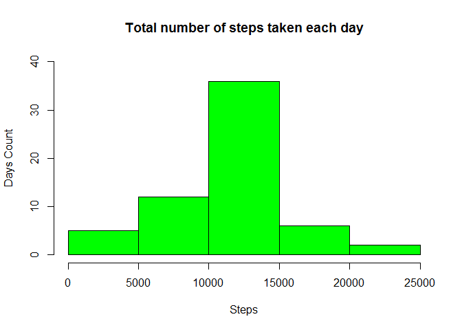

# Reproducible Research: Peer Assessment 1

## Loading and preprocessing the data

```r
data <- read.csv("activity.csv", sep=",")
##data <- subset(dataActivity, !is.na(dataActivity$steps))
```

## What is mean total number of steps taken per day

```r
##Calculate the total number of steps taken per day
dataTotStepsPerDay <- aggregate(steps ~ date, data=data, sum)

#Make a histogram of the total number of steps taken each day
hist(dataTotStepsPerDay$steps, main="Total number of steps taken each day", xlab="Steps", ylab="Days Count", ylim=range(0:40), col="blue")
```

<!-- -->

```r
##Calculate and report the mean and median of the total number of steps taken per day
boxplot(dataTotStepsPerDay$steps, main="Total number of steps taken per day", ylab="Steps")
abline(h=mean(dataTotStepsPerDay$steps), col="blue" )
```

<!-- -->

## What is the average daily activity pattern?

```r
##Make a time series plot (i.e. type = "l") of the 5-minute interval (x-axis) 
##and the average number of steps taken, averaged across all days (y-axis)
dataAvgStepsPerInt <- aggregate(steps ~ interval, data=data, mean)
with(dataAvgStepsPerInt, plot.ts(x=interval, y=steps, type="l", main="Average number of steps per interval", xlab="Interval (mins)", ylab="Steps"))

##Which 5-minute interval, on average across all the days in the dataset, contains the maximum number of steps?
abline(v=dataAvgStepsPerInt[which.max(dataAvgStepsPerInt$steps),]$interval, col="blue" )
```

<!-- -->


## Imputing missing values

```r
##Calculate and report the total number of missing values in the dataset (i.e. the total number of rows with NAs)
nrow(data[!complete.cases(data),])
```

```
## [1] 2304
```

```r
##Devise a strategy for filling in all of the missing values in the dataset. 
##The strategy does not need to be sophisticated. 
##For example, you could use the mean/median for that day, or the mean for that 5-minute interval, etc.
##Create a new dataset that is equal to the original dataset but with the missing data filled in.
dataFilled <- data
dataFilled$steps <- ifelse(is.na(dataFilled$steps) == TRUE, dataAvgStepsPerInt$steps[dataAvgStepsPerInt$interval %in% dataFilled$interval], dataFilled$steps)

##Make a histogram of the total number of steps taken each day and 
dataFilledTotStepsPerDay <- aggregate(steps~date, data = dataFilled, sum)
hist(dataFilledTotStepsPerDay$steps, main="Total number of steps taken each day", xlab="Steps", ylab="Days Count", ylim=range(0:40), col="green")
```

<!-- -->

```r
##Calculate and report the mean and median total number of steps taken per day. 
boxplot(dataFilledTotStepsPerDay$steps, main="Total number of steps taken per day", ylab="Steps")
abline(h=mean(dataFilledTotStepsPerDay$steps), col="green" )
```

<!-- -->

```r
##Do these values differ from the estimates from the first part of the assignment? 
##What is the impact of imputing missing data on the estimates of the total daily number of steps?
par(mfrow=c(1,2))
hist(dataTotStepsPerDay$steps, main="Total number of steps taken \n each day", xlab="Steps", ylab="Days Count", ylim=range(0:40), col="blue")
hist(dataFilledTotStepsPerDay$steps, main="Total number of steps taken \n each day (Filled)", xlab="Steps", ylab="Days Count", ylim=range(0:40), col="green")
```

<!-- -->


## Are there differences in activity patterns between weekdays and weekends?

```r
library(lattice) 

##Create a new factor variable in the dataset with two levels - "weekday" and "weekend" 
##indicating whether a given date is a weekday or weekend day.
weekends <- c("Saturday", "Sunday")
dataFilled$day <- weekdays(as.Date(dataFilled$date))
dataFilled$daytype <- ifelse(dataFilled$day %in% weekends, "weekend", "weekday")
dataFilled$daytype<-as.factor(dataFilled$daytype)

##Make a panel plot containing a time series plot (i.e. type = "l") of the 5-minute interval (x-axis) 
##and the average number of steps taken, averaged across all weekday days or weekend days (y-axis). 
dataFilledAvgStepsPerInt <- aggregate(steps~interval+daytype, data=dataFilled, mean)
with(dataFilledAvgStepsPerInt, 
     xyplot(steps~interval|daytype, 
            main="Activity patterns between weekdays and weekends",  
            xlab="Interval", 
            ylab="NUmber of steps", 
            type="l",
            layout=c(1,2)
            ))
```

<!-- -->
